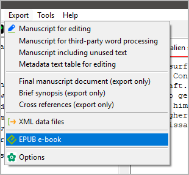

#  nv_epub

The [novelibre](https://github.com/peter88213/novelibre/) Python program helps authors organize novels.  

*nv_epub* is a plugin providing an EPUB exporter. 

## Features

- Exported EPUB e-books pass the EPUB 2.0.1 validation with 
  [EPUBcheck](https://www.w3.org/publishing/epubcheck/).
- All format styles used with *novelibre* are supported. 
- Footnotes are supported; endnotes are exported as footnotes. 
- If provided, a cover is included. 
- The e-book's file name is generated according to the 
  [Calibre](https://calibre-ebook.com/) default pattern, 
  so e-books managed by Calibre can be easily updated by overwriting.
- It is possible for the user to provide custom CSS stylesheets.

## Requirements

- [novelibre](https://github.com/peter88213/novelibre/) version 5.53+

## Download and install

### Default: Executable Python zip archive

Download the latest release [nv_epub_v5.0.4.pyz](https://github.com/peter88213/nv_epub/raw/main/dist/nv_epub_v5.0.4.pyz)

- Launch *nv_epub_v5.0.4.pyz* by double-clicking (Windows desktop),
- or execute `python nv_epub_v5.0.4.pyz` (Windows), resp. `python3 nv_epub_v5.0.4.pyz` (Linux) on the command line.

> [!IMPORTANT]
> Many web browsers recognize the download as an executable file and offer to open it immediately. 
> This starts the installation under Windows.
> 
> However, depending on your security settings, your browser may 
> initially  refuse  to download the executable file. 
> In this case, your confirmation or an additional action is required. 
> If this is not possible, you have the option of downloading 
> the zip file. 

### Alternative: Zip file

The package is also available in zip format: [nv_epub_v5.0.4.zip](https://github.com/peter88213/nv_epub/raw/main/dist/nv_epub_v5.0.4.zip)

- Extract the *nv_epub_v5.0.4* folder from the downloaded zipfile "nv_epub_v5.0.4.zip".
- Move into this new folder and launch *setup.py* by double-clicking (Windows/Linux desktop), 
- or execute `python setup.py` (Windows), resp. `python3 setup.py` (Linux) on the command line.

---

[Changelog](docs/changelog.md)

## Usage

See the [online manual](https://peter88213.github.io/nv_epub/help/)

---

## License

This is Open Source software, and the *nv_epub* plugin is licensed under GPLv3. See the
[GNU General Public License website](https://www.gnu.org/licenses/gpl-3.0.en.html) for more
details, or consult the [LICENSE](https://github.com/peter88213/nv_epub/blob/main/LICENSE) file.
